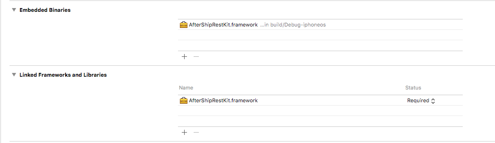

#AfterShipRestKit

This module provides a swifty interface to interact with [AfterShip REST API](https://www.aftership.com/docs/api/4). It is also my solution to [one of the AfterShip challanges on GitHub](https://github.com/AfterShip/challenge/tree/mobile-1)

### Use it in your own project

1. Use subtree feature in git to import the project
2. Drag the aftershiprestkit.xcodeproj into your own project
3. In project settings, add the framework to Embedded Binaries and Linked Frameworks and Libraries to targets that you are intended to use the library. This module supports iOS and watchOS. 

### Create the client
This module is designed to be easy to use with type checking and allow you to extend it for advance use

	import AfterShipRestKit
	
	let client = AfterShipClient(apiKey: apiKey)
	
By default it uses NSURLSession.sharedSession() to perform the request. You can pass in a seperate NSURLSession object to it or simply implementing the RequestAgent interface if you wish to use other network request library.

	let newSession = NSURLSession();
	let anotherClient = AfterShipClient(apiKey: apiKey, requestAgent: newSession);
	
### Get a single tracking

	client.getTracking(slug: slug, 
				trackingNumber: trackingNumber, 
				completionHandler: { (result) in
					switch result {
						case .Success(let response):
							print(response.json);
						case .Error(let errorType):
							print(errorType);
					}
	});
	
Response will be returned as a Successful/Error enumeration, it is designed like this to encourage error handling. It is recommmended to enumerate both case and avoid the use of default case. 

On successful, it will return the Response object which you can use its computed properties to retrive the values you need. You can also go straight into the raw object if necessary
	
	//You can get the raw values for the response
	let json: [String: AnyObject] = response.json;
			
	//Or use the provided helpers
	let tracking = response.tracking;
	let id = tracking?.id;
	let title = tracking?.title;
	
	
For more advanced usage 
	
	if var parameter = GetTrackingRequestParameters(slug: slug,
		trackingNumber:  trackingNumber,
		fields: [.Title, .AftershipId]) {
		
			// It is perfectly fine to do this if the module doesn't 
			// provide what you need.
			parameter.fields?.append("order_id");
		
			client.getTracking(parameters: parameter, completionHandler: onCompletion)
	}

### Create a tracking

	guard let newTracking = Tracking(trackingNumber: trackingNumber) else {
		return;
	}
	//There is a more convenient version as well
	self.client.createTracking(tracking: newTracking, completionHandler: onCompletion);

### Error handling
The client will internally manage the interaction between the client and server side.

#### Rate Limit
The client will refuse to make any request if the user has reached the API's maximum request rate. 

#### Expontential Backoff
If there is a quota available but the service previously return 429 or 500 errors, a delay will be applied before performing the request. The delay time will be calculated using exponential backoff with jitter.
	
The exponential backoff effect will be reset after inactivity for some time or sevice returned successful response.
 
### Extending the client
You can use the [extensions feature](https://developer.apple.com/library/ios/documentation/Swift/Conceptual/Swift_Programming_Language/Extensions.html) in swift to support more API endpoints.

	extension AfterShipClient {
		func getAllTrackings(completionHandler: PerformRequestCompletionHandler) {
			guard let url = self.createUrlComponents("/trackings").URL else {
				return;
			}
			let request = self.createUrlRequest(aftershipUrl: url, httpMethod: "GET")
			self.perform(request: request, completionHandler: completionHandler);
		}
	} 

